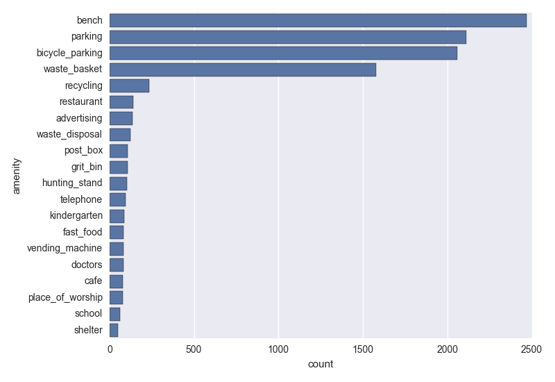
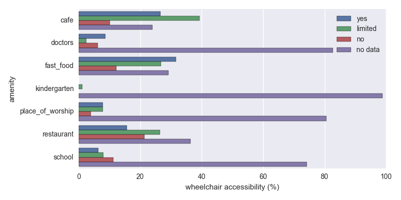

# Wrangle OpenStreetMap Data
_José Alves-Rausch_

Map Area: Göttingen, Niedersachsen, Germany

Code repository: [github.com/zelite/Wrangle-OpenStreetMap-Data/](https://github.com/zelite/Wrangle-OpenStreetMap-Data/)

Contents

<!-- TOC depthFrom:1 depthTo:6 withLinks:1 updateOnSave:1 orderedList:0 -->

- [Introduction](#introduction)
- [Problems Encountered in the Map](#problems-encountered-in-the-map)
	- [Auditing Validity](#auditing-validity)
	- [Auditing Accuracy](#auditing-accuracy)
	- [Auditing Completeness](#auditing-completeness)
	- [Auditing Uniformity](#auditing-uniformity)
- [Converting to JSON](#converting-to-json)
- [Data Overview](#data-overview)
- [Additional Ideas – Exploring Accessibility](#additional-ideas-exploring-accessibility)
- [Conclusion](#conclusion)
- [References](#references)

<!-- /TOC -->

## Introduction

The goal of this project is to get map data from a region of the world; audit the data; fix the problems found; import the data into a MongoDB database and run some exploratory queries against it. The place in the world that I chose is Göttingen because it is near my current location. Göttingen is most famous for its university from which “45 Nobel Prize Laurates were linked via their Curriculum Vitae” (Georg-August-Universität Göttingen, 2015).

## Problems Encountered in the Map
### Auditing Validity

The map region between latitudes 51.49 and 51.59, and longitudes 9.80 and 10.05, was obtained using the Overpass API (Wiki.openstreetmap.org, 2015a). The data comes in a XML file. In order to validate the validity of the file, an XML schema file, adapted from Schrenk (2012) was used. Using the lxml python library, it is possible to use the schema to validate the XML file while parsing it (Lxml.de, 2015). Please note, that although several users have come up with schema specifications, there is no official schema for the OSM XML (Wiki.openstreetmap.org, 2015b).

Because of the large size of the file, an iterative validation was performed (`iterative_validator`).

**No problems were found in structure of the XML file.**

### Auditing Accuracy

Auditing accuracy, means checking if our data is correct, i.e., does it conform to a gold standard? It was hard to find any authoritative source of data to which to compare the OpenStreetMaps data. The Deutsche Post provides data of postal codes, street names, buildings and geo-data (Deutschepost.de, 2015), which may be useful when developing a commercial project. However, the limited budget of this project does not allow me to use such a resource. Alternatively, I will use the online maps of the city of Göttingen (Stadtplan.goettingen.de, 2015). On this website we can access simple maps and search for street names. The amount of data that we can extract from it is limited, but we can get a listing of street names. We can compare the street names from the OSM file with the street names extracted from the website. Note that the list names provided by the Göttingen website does not include all street names. Some small street segments do not have a name in this online maps. Additionally, when extracting the map area from OSM, a rectangle area was selected which includes more than the Göttingen city administrative region. Therefore there will be several streets that are not present in the list of street names extracted from the official city maps. Nevertheless, I will use the list of street names as a quick reference to audit for typos in the street names.

For each street name found in the OSM data I check if the street exists in the list from the Göttingen city. If the name does not exist, the closest street name match is selected. Then, I manually check this closest matches and select the ones which need to be corrected. The criteria for correction is if the mismatch results from a typo. The list of street names to be corrected is saved in a .csv file which is then used to clean up the OSM XML file. Because there is a manual step involved, there’s the chance of missing some incorrect street names or introducing a new mistake. I will accept that for this project, since there is no better gold standard available.

**18 street names were marked for correction.**

### Auditing Completeness

Auditing completeness is not really possible without an authoritative data source to which to compare our data. Since all sorts of things can be added to the map data – e.g.: amenities, bike paths, bus stops – and the dynamic nature of the cities – new businesses open, transportation network is updated – **we can never consider that a city map is complete.**

### Auditing Uniformity

As an example of auditing for uniformity, is checking the format of the phone numbers included in the OSM file. A first look into the phone numbers shows that the phone numbers are not represented in a standardized way. Most are formatted in an international format (e.g.: +49 1234 56789), while a few use the national prefix with a leading zero, and some have hiphens inside the phone number. On this step I will **use the python library “phonenumbers” to format all the phone numbers to the international format** (Drysdale, 2015).

Some phone number tags show more than one phone number separated by a comma. These will be converted to a list in the JSON file. Others do not have a leading “+” before the “49” which is the international prefix. Some phone number entries have the text “keine”. **The auditing showed 3858 phone numbers in the international format and 783 in other formats. All the phone numbers will be converted to the international format.**

## Converting to JSON

Before importing the OSM data into a MongoDB we will convert the XML data to a JSON file and then use the `mongoimport` tool to insert this data in the MongoDB database. During the conversion to JSON we will correct some of the problems found in the auditing process, namely:

- correct typos in street names
- standardize the telephone numbers

Only the elements of type “node” and “way” will be imported to the database. The data model we’re going to use follows the format of this example:

```
{
"id": "2406124091",
"type: "node",
"visible":"true",
"created": {
         "version":"2",
         "changeset":"17206049",
         "timestamp":"2013-08-03T16:43:42Z",
         "user":"linuxUser16",
         "uid":"1219059"
       },
"pos": [41.9757030, -87.6921867],
"address": {
         "housenumber": "5157",
         "postcode": "60625",
         "street": "North Lincoln Ave"
       },
"amenity": "restaurant",
"cuisine": "mexican",
"name": "La Cabana De Don Luis",
"phone": "1 (773)-271-5176"
}
```

## Data Overview
On this section we will provide some descriptive statistics about our dataset.
Our starting files have the following sizes:

```
goettingen.osm 114 MB
goettingen.osm.json 160 MB
```

The JSON file was imported to the MongoDB using the mongoimport tool.
The interaction with the MongoDB was made using the pymongo driver.
There are 520 unique users.

```
len(db.goettingen.distinct("created.user"))
520
```

88693 is the number of ways.

```
db.goettingen.find({"type":"way"}).count()
88693
```

We have 466772 nodes.

```
db.goettingen.find({"type":"node"}).count()
466772
```

After all this work, I am feeling hungry. I wonder how many vending machines sell food in the Göttingen area.

```
db.goettingen.find({"amenity":"vending_machine",
                   "vending": {"$in": ["food", "food;drinks"]}
                   }).count()
10
```

Just 10 vending machines with food. That is a bit disappointing.

## Additional Ideas – Exploring Accessibility

On this section I will explore which information about wheelchair accessibility is present in the OSM data for the region of Göttingen.
Let us begin by having a look at the top 20 amenities found in the Göttingen area. The code for the plots is included in the `data_overview.py` script.



_Figure 1 – Top 20 amenity types found in the OSM data._

We can see that there are lots of benches, parking spots (cars and bikes) and waste baskets. We will focus on the amenities where people can actually walk inside: restaurants, kindergartens, fast food restaurants, doctor´s offices, cafes, places of worship and schools.



_Figure 2 – Accessibility percentage for each type of amenity._

We can see that for the chosen amenities, most do not have information about wheelchair accessibility. For the ones with information, the combination of “yes” and “limited” accessibility is always higher than the “no”.

Given the importance of this information for wheelchair users, it would be beneficial to make sure all the amenities actually provide this information. The OSM wiki provides information on how amenities and ways should be tagged to provide the wheelchair accessibility information (Wiki.openstreetmap.org, 2015c). However, it clear that many of the amenities simply do not provide any information. A more exhaustive documentation of the accessibility situation of every amenity would be beneficial for wheelchair users to make decisions on where to go, and could also put pressure on the amenities with bad accessibility to improve their spaces.

In order to improve the data gap, it would be necessary to involve the OSM user community. As a first step, a list of ways and amenities without the accessibility information should be compiled. This could even be presented on a map as “missing data hotspots”. Then, a group of volunteers needs to visit the places and document the real situation. To make sure the documentation is accurate, the users should consult with wheelchair users to make sure that the description of the accessibility situation is accurate. As an example, the OpenStreetMaps wiki mentions: “Hint: Always think of heavy electric wheelchairs that can not pass any steps.”

The guidelines to provide information about wheelchair accessibility already exist in the OSM project. Therefore, what can be done on the database level is documenting where the data is missing. To be sure of the real accessibility situation, actually visiting the places seems essential. A way speeding up the collection of information, would be to develop a app for wheelchair users which could track which ways and places they were on, and add the information to the OSM project. However, this solution would not cover the cases where there is no information and it is not possible to access by wheelchair. The data would stay missing, which is less useful than an actual “wheelchair=no” information.

## Conclusion
On this project we have seen that the OpenStreetMaps have very detailed information about the city of Göttingen. Given the open nature of the project, many people contribute in slightly different ways which can introduce errors or simply different consistency in the way the information is formatted. Some errors were fixed in street name addresses and an example of standardization of phone numbers formatting was shown. Using the power of MongoDB the information regarding wheelchair accessibility of the amenities in Göttingen was explored and we found that many of the amenities do not have data regarding the accessibility status.

## References

Georg-August-Universität Göttingen, (2015). _Nobel Prize Laureates from Göttingen._ [online] Uni-goettingen.de. Available at: https://www.uni-goettingen.de/en/nobel-prize-laureates-from-g%C3%B6ttingen/4281.html [Accessed 9 Dec. 2015].

Wiki.openstreetmap.org, (2015a). _Overpass API - OpenStreetMap Wiki._ [online] Available at: http://wiki.openstreetmap.org/wiki/Overpass_API [Accessed 9 Dec. 2015].

Schrenk, O. (2012). _oschrenk/gis-java._ [online] GitHub. Available at: https://github.com/oschrenk/gis-java/blob/master/lib/gis/formats/osm.io/src/main/resources/OSMSchema.xsd [Accessed 9 Dec. 2015].

Lxml.de, (2015). _Validation with lxml._ [online] Available at: http://lxml.de/validation.html#validation-at-parse-time [Accessed 9 Dec. 2015].

Wiki.openstreetmap.org, (2015b). _OSM XML - OpenStreetMap Wiki._ [online] Available at: http://wiki.openstreetmap.org/wiki/OSM_XML [Accessed 9 Dec. 2015].

Deutschepost.de, (2015). _DATAFACTORY._ [online] Available at: https://www.deutschepost.de/en/d/deutsche-post-direkt/datafactory.html [Accessed 9 Dec. 2015].

Stadtplan.goettingen.de, (2015). _Online-Stadtplan Göttingen._ [online] Available at: http://stadtplan.goettingen.de/ [Accessed 9 Dec. 2015].

Drysdale, D. (2015). _daviddrysdale/python-phonenumbers._ [online] GitHub. Available at: https://github.com/daviddrysdale/python-phonenumbers [Accessed 22 Dec. 2015].

Wiki.openstreetmap.org, (2015). _Key:wheelchair - OpenStreetMap Wiki._ [online] Available at: http://wiki.openstreetmap.org/wiki/Key:wheelchair [Accessed 23 Dec. 2015].
